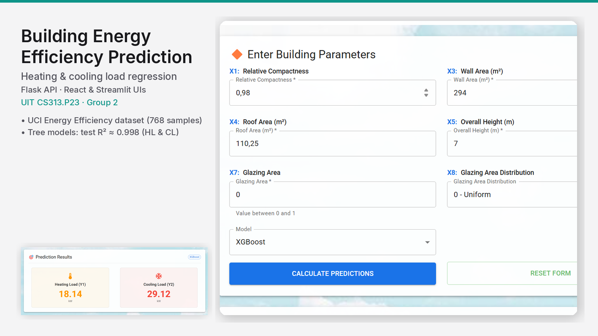
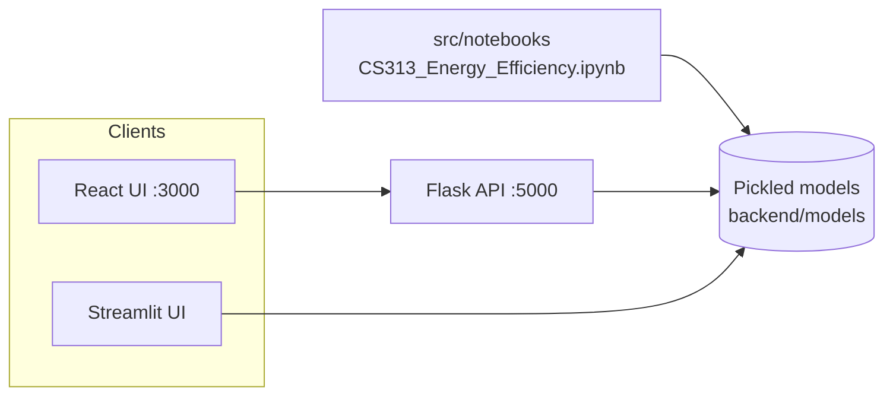
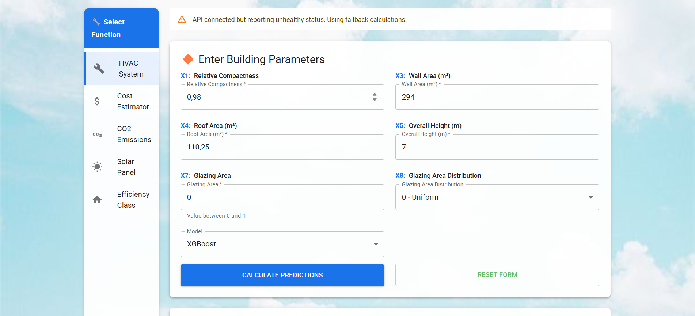
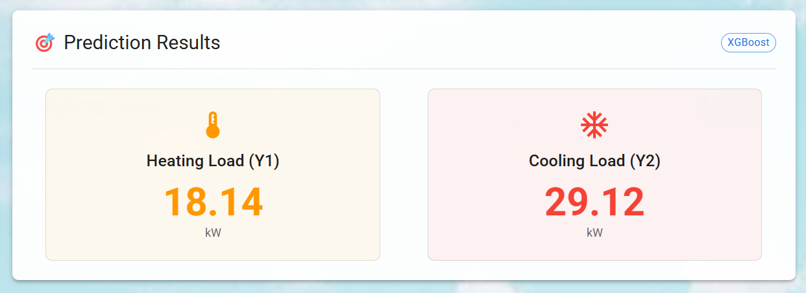
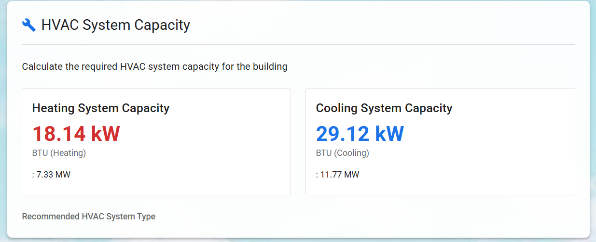
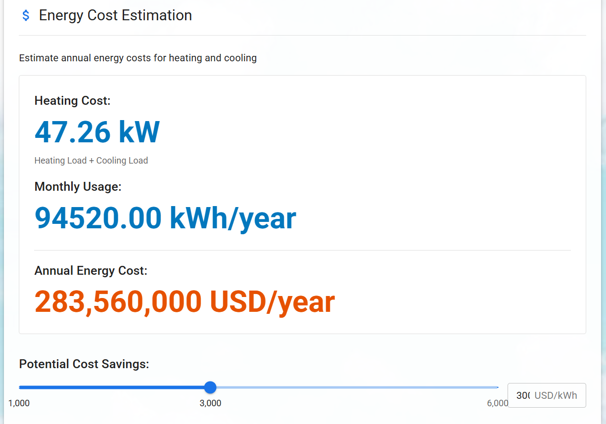
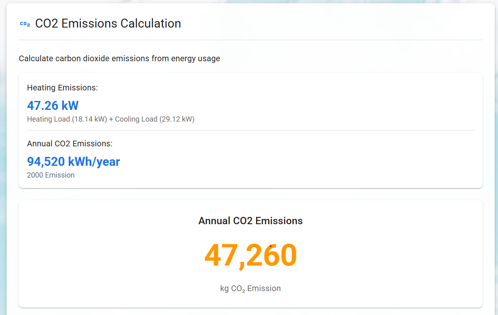

# Building Energy Efficiency Prediction

**Predict heating and cooling loads from building geometry and glazing parameters, with a Flask API and React and Streamlit frontends.**



| | |
|---|---|
| **Course** | CS313.P23 — Data Mining and Application |
| **Institution** | [University of Information Technology (UIT)](https://www.uit.edu.vn/), VNU-HCM |
| **Period** | April–May 2025 (per repository commit history) |
| **Repository** | [github.com/dinhthienan33/CS313.P23-Group2](https://github.com/dinhthienan33/CS313.P23-Group2) |

## Overview

Architects and HVAC designers often need early estimates of how much heating and cooling a building will require. This project trains regression models on the [UCI Energy Efficiency dataset](https://archive.ics.uci.edu/ml/datasets/Energy+efficiency) (768 simulated building samples, eight input features) and exposes predictions through:

- A **Flask REST API** with serialized scikit-learn / XGBoost models
- A **React** dashboard (energy prediction, HVAC sizing, cost, CO₂, solar panel hints, EN/VI)
- A **Streamlit** app with the same practical calculators

Downstream tabs use Vietnamese city electricity references and rule-of-thumb HVAC guidance documented in the course report; treat those outputs as illustrative, not certified engineering advice.

## Architecture



## Model results

Metrics below are **held-out test scores** from `src/notebooks/CS313_Energy_Efficiency.ipynb` (80/20 split after preprocessing). Values are rounded to four decimal places as in the notebook.

### Heating load (HL)

| Model | MAE | RMSE | R² |
| --- | ---: | ---: | ---: |
| Decision Tree | 0.3727 | 0.5018 | 0.9976 |
| Random Forest | 0.3770 | 0.5020 | 0.9976 |
| K-Nearest Neighbors | 0.3883 | 0.5139 | 0.9975 |
| XGBoost | 0.3844 | 0.5320 | 0.9973 |
| SVM | 1.1343 | 2.1162 | 0.9570 |
| Linear Regression | 2.0303 | 2.8280 | 0.9233 |

### Cooling load (CL)

| Model | MAE | RMSE | R² |
| --- | ---: | ---: | ---: |
| Random Forest | 0.3748 | 0.4979 | 0.9976 |
| Decision Tree | 0.3715 | 0.4988 | 0.9976 |
| K-Nearest Neighbors | 0.3850 | 0.5101 | 0.9975 |
| XGBoost | 0.3834 | 0.5264 | 0.9973 |
| SVM | 1.1382 | 2.0904 | 0.9581 |
| Linear Regression | 2.0300 | 2.8332 | 0.9230 |

**Deployment note:** The API and UIs default to **Random Forest** regressors bundled under `backend/models/` (`heating_AL.pkl`, `cooling_AL.pkl`, with `col_transformer.pkl`). Tree-based models reach **R² ≈ 0.997** on both targets in the notebook; linear models are weaker on this split.

## Screenshots

| Main React dashboard | Load prediction |
| --- | --- |
|  |  |

| HVAC sizing | Energy cost | CO₂ estimate |
| --- | --- | --- |
|  |  |  |

## Repository structure

```
CS313.P23-Group2/
├── backend/                 # Flask API (app.py, models/, tests/)
├── frontend/                # React SPA (Material UI)
├── streamlit_app/           # Streamlit UI (app1.py, tab.py, models/)
├── src/
│   ├── data/ENB2012_data.csv
│   └── notebooks/           # Training & evaluation notebooks
├── assets/                  # UI screenshots for documentation
├── docs/assets/             # Portfolio card (card.png)
├── report/CS313_report.pdf
├── slides/CS313_slide.pdf
├── docker-compose.yml       # API + React containers
└── demo_samples.xlsx        # Sample inputs for demos
```

## Getting started

### Prerequisites

- Python 3.8+
- Node.js 18+ (for the React app)
- Docker & Docker Compose (optional)

### Backend API

```bash
git clone https://github.com/dinhthienan33/CS313.P23-Group2.git
cd CS313.P23-Group2/backend
python -m venv venv
source venv/bin/activate   # Windows: venv\Scripts\activate
pip install -r requirements.txt
python app.py
```

API base URL: `http://localhost:5000` — health check at `/health`, prediction at `POST /api/predict`. See [backend/README.md](backend/README.md) for request/response examples.

### React frontend

```bash
cd frontend
npm install
REACT_APP_API_URL=http://localhost:5000/api npm start
```

Opens at `http://localhost:3000`.

### Streamlit frontend

From the repo root, with the same scientific stack as the backend plus Streamlit and XGBoost:

```bash
pip install -r backend/requirements.txt streamlit xgboost
cd streamlit_app
streamlit run app1.py
```

### Docker Compose (API + React)

```bash
docker compose up --build
```

- React: [http://localhost:3000](http://localhost:3000)
- API: [http://localhost:5000](http://localhost:5000)

## Team — Group 2

| # | Student ID | Name | Email |
| --- | --- | --- | --- |
| 1 | 22520003 | Huỳnh Trọng Nghĩa | 22520003@gm.uit.edu.vn |
| 2 | 22520010 | Đinh Thiên Ân | 22520010@gm.uit.edu.vn |
| 3 | 22520019 | Nguyễn Ân | 22520019@gm.uit.edu.vn |
| 4 | 22520021 | Nguyễn Hoàng Gia An | 22520021@gm.uit.edu.vn |
| 5 | 22520069 | Phạm Nguyên Anh | 22520069@gm.uit.edu.vn |
| 6 | 22520109 | Nguyễn Gia Bảo | 22520109@gm.uit.edu.vn |

## Report and slides

- [Project report (PDF)](report/CS313_report.pdf) — methodology, experiments, and discussion
- [Presentation slides (PDF)](slides/CS313_slide.pdf)

## References

1. Tsanas, A., & Xifara, A. (2012). Accurate quantitative estimation of energy performance of residential buildings using statistical machine learning tools. *Energy and Buildings*, 49, 560–567.
2. UCI Machine Learning Repository: [Energy Efficiency Dataset](https://archive.ics.uci.edu/ml/datasets/Energy+efficiency)
3. Moayedi, H., et al. (2019). Predicting Heating Load in Energy-Efficient Buildings Through Machine Learning Techniques. *Applied Sciences*, 9(20), 4338.

### Citation (dataset source paper)

```bibtex
@article{tsanas2012accurate,
  title={Accurate quantitative estimation of energy performance of residential buildings using statistical machine learning tools},
  author={Tsanas, Athanasios and Xifara, Angeliki},
  journal={Energy and Buildings},
  volume={49},
  pages={560--567},
  year={2012},
  publisher={Elsevier}
}
```

## License

License: **not yet specified** (no `LICENSE` file in this repository).

---

<p align="center">UIT CS313.P23 Group 2 · 2025</p>
