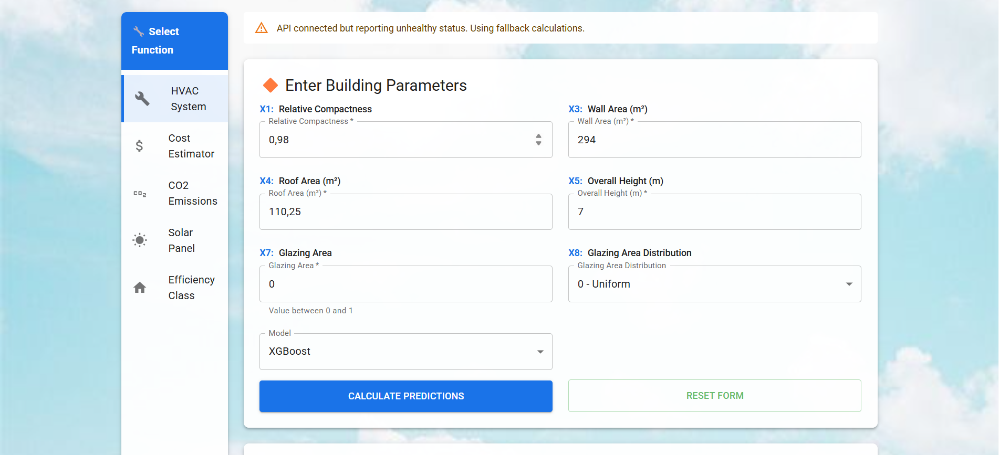
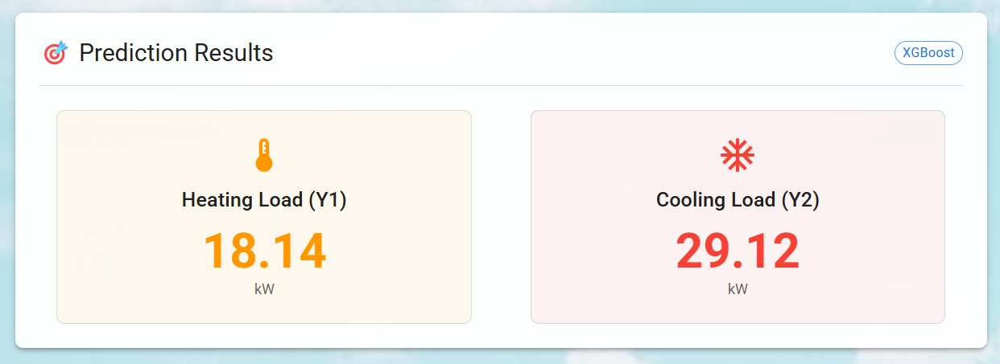
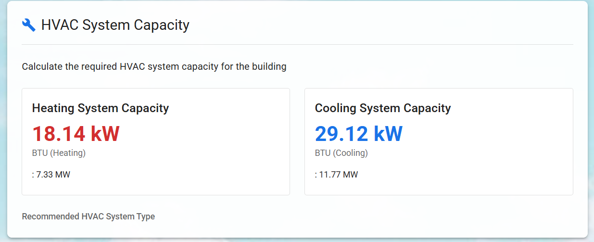
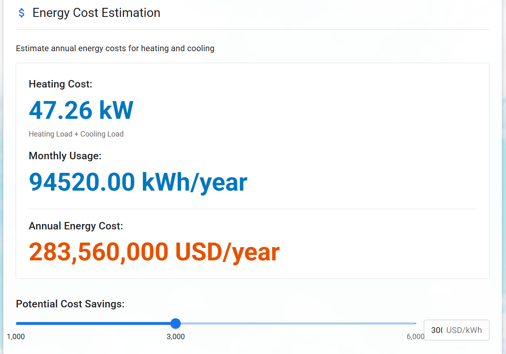
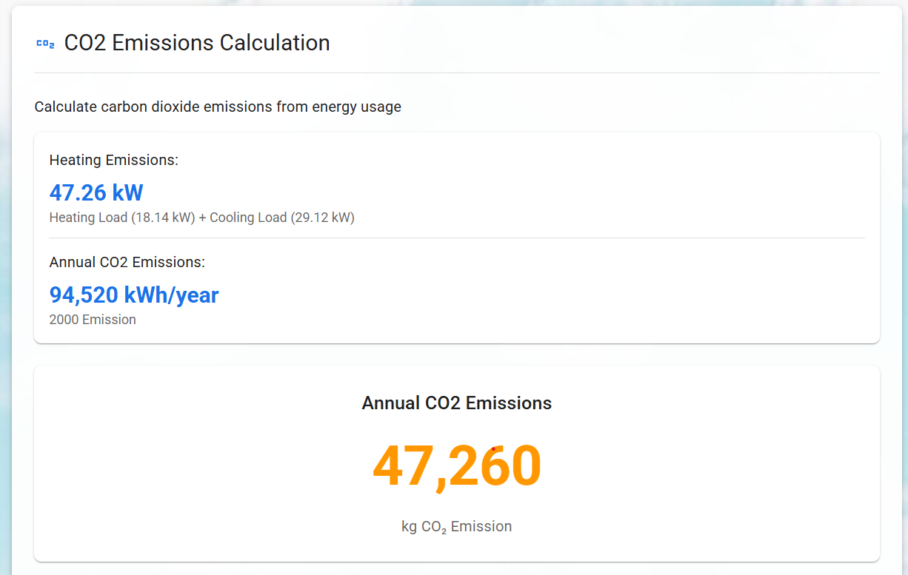

# Energy Efficiency Prediction App

This is a React.js application for predicting building energy efficiency based on architectural parameters. The app provides various functionalities:

- Energy efficiency prediction (heating and cooling loads)
- HVAC system capacity calculation
- Energy cost estimation
- CO₂ emissions calculation
- Solar panel recommendation
- Building energy efficiency classification
- Multilingual support (English and Vietnamese)

## Setup Instructions

### Frontend

1. Navigate to the project root:
```bash
cd energy-efficiency-app
```

2. Install dependencies:
```bash
npm install
```

3. Start the development server:
```bash
npm start
```

4. Build for production:
```bash
npm run build
```

### Backend API (Optional)

The application includes a simple Express.js server that simulates ML model predictions. To run it:

1. Navigate to the server directory:
```bash
cd server
```

2. Install dependencies:
```bash
npm install
```

3. Start the server:
```bash
npm run dev
```

Note: The frontend will automatically use mock predictions if the API server is not running.

## Features

- Modern React.js with functional components and hooks
- Material-UI for responsive design
- Client-side prediction using pre-trained models
- Interactive forms with validation
- Visualizations of prediction results
- Multiple calculation modules for different energy-related metrics
- Multilingual support with English and Vietnamese translations
- Persistent language preference (stored in localStorage)

## Screenshots

### Main Page

*The main interface of the application with input form and language toggle in the top-right corner*

### Prediction Results

*Prediction results showing heating and cooling loads*

### HVAC System Calculator

*HVAC system capacity calculation based on prediction results*

### Energy Cost Estimator

*Energy cost estimation with adjustable parameters*

### CO2 Emissions Calculator

*CO2 emissions calculation and environmental impact*

## Language Support

The application supports both English and Vietnamese languages. Users can toggle between languages by clicking the language button in the top-right corner of the header. The language preference is saved in the browser's localStorage and persists between sessions.

### Translation Implementation

The translation system uses React Context API to manage language state across the application:

- `LanguageContext.js`: Provides language state and toggle functionality
- `translations.js`: Contains translation strings for both languages
- Each component uses the `useLanguage` hook to access translations

## Original Conversion

This application was converted from a Streamlit Python application to React.js. The original Streamlit application used ML models to predict building energy efficiency based on architectural parameters.

## Technologies Used

- React.js 18
- Material-UI 5
- Axios for API requests
- Express.js for the backend API
- Chart.js for data visualization
- React Context API for state management
- localStorage for persistent preferences